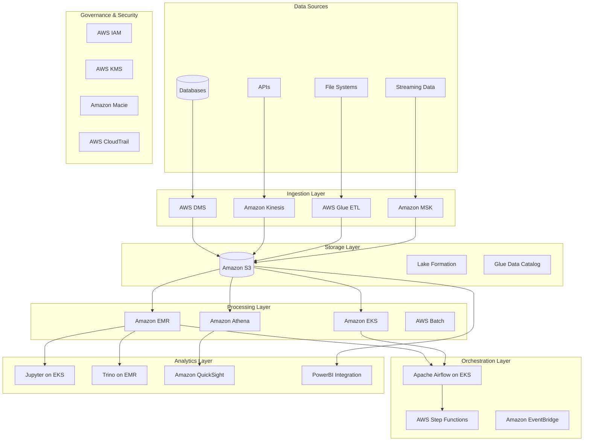

# AWS Open Source Data Lake Migration - Design Document

## Overview

This design document outlines a comprehensive AWS-based open-source data lake platform to replace DataX's current Databricks on Azure implementation. The solution leverages AWS managed services combined with open-source technologies to create a cost-effective, scalable, and FSI-compliant data platform that reduces operational costs by 40% while maintaining equivalent or superior capabilities.

The architecture follows a layered approach with clear separation of concerns: ingestion, storage, processing, governance, and analytics layers, each optimized for specific workloads and integrated through standardized interfaces and protocols.

## Architecture

### High-Level Architecture



### Network Architecture

The platform will be deployed across multiple AWS Availability Zones within a dedicated VPC with the following network segmentation:

- **Public Subnets**: Load balancers and NAT gateways
- **Private Subnets**: Application and processing workloads
- **Database Subnets**: Metadata stores and caching layers
- **Management Subnets**: Monitoring and administrative tools

## Components and Interfaces

### 1. Data Ingestion Layer

#### Amazon Kinesis Data Streams & Firehose
**Purpose**: Real-time data ingestion and streaming analytics
**Configuration**:
- Kinesis Data Streams for high-throughput, low-latency ingestion
- Kinesis Data Firehose for direct S3 delivery with transformation
- Auto-scaling based on incoming data volume
- Integration with Lambda for real-time processing

**Interfaces**:
- REST APIs for application integration
- SDK support for multiple programming languages
- Direct integration with AWS services
- Custom producers for legacy systems

#### AWS Database Migration Service (DMS)
**Purpose**: Continuous replication from source databases
**Configuration**:
- Multi-AZ deployment for high availability
- Change Data Capture (CDC) for real-time synchronization
- Support for heterogeneous database migrations
- Automatic schema conversion when needed

**Interfaces**:
- Native database connectors (Oracle, SQL Server, MySQL, PostgreSQL)
- S3 as target endpoint with Parquet format
- CloudWatch integration for monitoring
- SNS notifications for replication status

#### Amazon Managed Streaming for Kafka (MSK)
**Purpose**: Event streaming platform for complex event processing
**Configuration**:
- Multi-broker setup across AZs
- Apache Kafka 2.8+ with KRaft mode
- Auto-scaling and automatic patching
- Integration with Schema Registry

**Interfaces**:
- Kafka Connect for source/sink connectors
- REST Proxy for HTTP-based access
- SASL/SCRAM authentication
- TLS encryption in transit

### 2. Storage Layer

#### Amazon S3 Data Lake
**Purpose**: Primary data lake storage with multiple zones
**Configuration**:
- **Raw Zone**: Immutable source data in original formats
- **Refined Zone**: Cleaned and validated data in optimized formats
- **Curated Zone**: Business-ready datasets and aggregations
- **Archive Zone**: Long-term retention with Glacier storage classes

**Storage Optimization**:
- S3 Intelligent Tiering for automatic cost optimization
- Lifecycle policies for automated data archival
- Cross-Region Replication for disaster recovery
- S3 Transfer Acceleration for global data uploads

**Interfaces**:
- S3 REST API and SDKs
- S3 Select for in-place querying
- S3 Event Notifications for trigger-based processing
- VPC Endpoints for secure access

#### AWS Lake Formation
**Purpose**: Centralized data lake governance and security
**Configuration**:
- Fine-grained access controls at database, table, and column levels
- Data location registration and management
- Integration with AWS Glue Data Catalog
- Cross-account data sharing capabilities

**Security Features**:
- Row and column-level security
- Data filtering based on user attributes
- Audit logging for all data access
- Integration with external identity providers

#### AWS Glue Data Catalog
**Purpose**: Centralized metadata repository
**Configuration**:
- Automatic schema discovery and evolution
- Data lineage tracking
- Custom classifiers for proprietary formats
- Partition projection for performance optimization

**Interfaces**:
- Hive Metastore compatibility
- REST APIs for metadata operations
- Integration with Apache Spark and Presto/Trino
- CloudFormation support for infrastructure as code

### 3. Processing Layer

#### Amazon EMR (Elastic MapReduce)
**Purpose**: Managed big data processing with Apache Spark
**Configuration**:
- EMR on EC2 with auto-scaling groups
- Spot Instance integration for cost optimization
- Multiple cluster configurations for different workloads:
  - **Interactive Clusters**: Long-running for ad-hoc analysis
  - **Transient Clusters**: Job-specific with automatic termination
  - **Streaming Clusters**: Dedicated for real-time processing

**Optimizations**:
- EMR Runtime for Spark with 3x performance improvements
- S3 optimizations with EMRFS
- Ganglia and Spark History Server for monitoring
- Integration with Jupyter and Zeppelin notebooks

**Interfaces**:
- Spark SQL, PySpark, Scala APIs
- Livy REST API for remote job submission
- YARN ResourceManager for cluster management
- Hive and Presto query engines

#### Amazon EKS (Elastic Kubernetes Service)
**Purpose**: Container orchestration for open-source tools
**Configuration**:
- Managed control plane with worker node groups
- Fargate integration for serverless containers
- Cluster Autoscaler for dynamic scaling
- AWS Load Balancer Controller for ingress

**Deployed Applications**:
- **Apache Airflow**: Workflow orchestration
- **Jupyter Hub**: Multi-user notebook environment
- **Trino/Presto**: Distributed SQL query engine
- **Apache Superset**: Modern BI and visualization
- **MLflow**: Machine learning lifecycle management

**Interfaces**:
- Kubernetes APIs and kubectl
- Helm charts for application deployment
- Service mesh with Istio for advanced networking
- Prometheus and Grafana for monitoring

#### Amazon Athena
**Purpose**: Serverless interactive query service
**Configuration**:
- Presto-based engine with automatic scaling
- Query result caching for performance
- Workgroup isolation for cost control
- Integration with QuickSight for visualization

**Optimizations**:
- Columnar formats (Parquet, ORC) for better performance
- Partition pruning and projection
- Compression algorithms (GZIP, Snappy, LZ4)
- Query optimization with statistics

### 4. Orchestration Layer

#### Apache Airflow on Amazon EKS
**Purpose**: Workflow orchestration and pipeline management
**Configuration**:
- Kubernetes Executor for scalable task execution
- PostgreSQL on RDS for metadata database
- Redis on ElastiCache for task queuing
- Auto-scaling based on task queue depth

**Features**:
- DAG version control with Git integration
- Custom operators for AWS services
- SLA monitoring and alerting
- Multi-environment deployment (dev, staging, prod)

**Interfaces**:
- Web UI for DAG monitoring and management
- REST API for programmatic access
- CLI for administrative tasks
- Python SDK for DAG development

#### AWS Step Functions
**Purpose**: Serverless workflow orchestration
**Configuration**:
- Express Workflows for high-volume, short-duration tasks
- Standard Workflows for long-running processes
- Integration with 200+ AWS services
- Visual workflow designer

**Use Cases**:
- ETL pipeline coordination
- Machine learning model training workflows
- Data quality validation processes
- Error handling and retry logic

#### Amazon EventBridge
**Purpose**: Event-driven architecture and service integration
**Configuration**:
- Custom event buses for different domains
- Schema registry for event structure management
- Dead letter queues for failed events
- Cross-account event routing

**Event Sources**:
- S3 object creation/modification events
- Database change events from DMS
- Application-generated business events
- Scheduled events for batch processing

### 5. Analytics and BI Layer

#### Trino/Presto on Amazon EMR
**Purpose**: Distributed SQL query engine for interactive analytics
**Configuration**:
- Coordinator and worker node separation
- Memory-optimized instances for large queries
- Connector ecosystem for multiple data sources
- Query federation across different systems

**Connectors**:
- Hive connector for S3 data lake
- PostgreSQL connector for operational data
- Elasticsearch connector for log analytics
- Delta Lake and Iceberg connectors for ACID transactions

#### Jupyter Hub on Amazon EKS
**Purpose**: Multi-user data science environment
**Configuration**:
- JupyterHub with Kubernetes spawner
- Persistent volume claims for user workspaces
- GPU-enabled instances for ML workloads
- Integration with Git repositories

**Features**:
- Pre-configured kernels (Python, R, Scala, SQL)
- Shared datasets and libraries
- Collaboration features and notebook sharing
- Integration with MLflow for experiment tracking

#### Amazon QuickSight
**Purpose**: Cloud-native business intelligence
**Configuration**:
- Enterprise edition with advanced features
- SPICE in-memory engine for fast queries
- Auto-scaling based on user demand
- Integration with Active Directory

**Data Sources**:
- Direct connection to Athena and Redshift
- S3 data source with automatic schema detection
- Real-time dashboards with streaming data
- Embedded analytics for custom applications

### 6. Governance and Security Layer

#### AWS Identity and Access Management (IAM)
**Purpose**: Fine-grained access control and authentication
**Configuration**:
- Role-based access control (RBAC) with least privilege
- Cross-account roles for multi-account architecture
- Service-linked roles for AWS service integration
- Integration with corporate identity providers (SAML/OIDC)

**Security Policies**:
- Data lake access policies with Lake Formation
- Service-specific policies for each component
- Conditional access based on IP, time, and MFA
- Regular access reviews and policy auditing

#### AWS Key Management Service (KMS)
**Purpose**: Encryption key management and data protection
**Configuration**:
- Customer-managed keys for sensitive data
- Automatic key rotation policies
- Cross-region key replication for DR
- Integration with CloudTrail for key usage auditing

**Encryption Strategy**:
- S3 server-side encryption with KMS keys
- EBS volume encryption for compute instances
- RDS encryption for metadata databases
- In-transit encryption for all data movement

#### Amazon Macie
**Purpose**: Data classification and privacy protection
**Configuration**:
- Automated sensitive data discovery
- Custom data identifiers for FSI-specific patterns
- Policy findings and remediation workflows
- Integration with Security Hub for centralized monitoring

**Classification Rules**:
- PII detection (SSN, credit card numbers, phone numbers)
- Financial data patterns (account numbers, routing numbers)
- Custom patterns for proprietary data formats
- Automated tagging and policy enforcement

#### AWS CloudTrail
**Purpose**: Comprehensive audit logging and compliance
**Configuration**:
- Organization-wide trail for all accounts
- Data events logging for S3 and Lambda
- Log file integrity validation
- Integration with CloudWatch for real-time monitoring

**Compliance Features**:
- Immutable audit logs with S3 Object Lock
- Log aggregation across multiple regions
- Automated compliance reporting
- Integration with SIEM systems

## Data Models

### Metadata Schema

The platform uses a standardized metadata schema across all components:

```json
{
  "dataset": {
    "id": "unique_identifier",
    "name": "human_readable_name",
    "description": "dataset_description",
    "owner": "data_owner_email",
    "created_date": "ISO_8601_timestamp",
    "last_modified": "ISO_8601_timestamp",
    "schema": {
      "columns": [
        {
          "name": "column_name",
          "type": "data_type",
          "nullable": true/false,
          "description": "column_description",
          "classification": "public/internal/confidential/restricted"
        }
      ]
    },
    "lineage": {
      "upstream_datasets": ["dataset_ids"],
      "downstream_datasets": ["dataset_ids"],
      "transformations": ["transformation_descriptions"]
    },
    "quality_metrics": {
      "completeness": "percentage",
      "accuracy": "percentage",
      "consistency": "percentage",
      "timeliness": "sla_compliance"
    },
    "access_controls": {
      "readers": ["iam_roles"],
      "writers": ["iam_roles"],
      "administrators": ["iam_roles"]
    }
  }
}
```

### Data Lake Zones

#### Raw Zone (Bronze)
- **Purpose**: Immutable storage of source data
- **Format**: Original format (JSON, CSV, XML, binary)
- **Partitioning**: By source system and ingestion date
- **Retention**: 7 years for compliance
- **Access**: Restricted to data engineers and system accounts

#### Refined Zone (Silver)
- **Purpose**: Cleaned and validated data
- **Format**: Parquet with Snappy compression
- **Partitioning**: By business domain and date
- **Schema**: Standardized across similar datasets
- **Quality**: Data quality rules applied and validated

#### Curated Zone (Gold)
- **Purpose**: Business-ready analytical datasets
- **Format**: Delta Lake or Iceberg for ACID transactions
- **Partitioning**: Optimized for query patterns
- **Aggregations**: Pre-computed metrics and KPIs
- **Access**: Available to business users and analysts

### Table Formats

#### Apache Iceberg
**Use Cases**: Large analytical tables with frequent updates
**Features**:
- ACID transactions with snapshot isolation
- Schema evolution without table rewrites
- Hidden partitioning for automatic optimization
- Time travel queries for historical analysis

#### Delta Lake
**Use Cases**: Streaming data with batch processing
**Features**:
- ACID transactions with optimistic concurrency
- Unified batch and streaming processing
- Data versioning and rollback capabilities
- Automatic file compaction and optimization

#### Apache Hudi
**Use Cases**: Near real-time data lakes with updates
**Features**:
- Record-level updates and deletes
- Incremental processing capabilities
- Multiple query types (snapshot, incremental, read-optimized)
- Built-in data quality and consistency checks

## Error Handling

### Data Pipeline Error Handling

#### Ingestion Layer Errors
- **Schema Mismatch**: Automatic schema evolution with backward compatibility
- **Data Quality Issues**: Quarantine bad records with detailed error logging
- **Source System Failures**: Exponential backoff retry with circuit breaker pattern
- **Network Issues**: Automatic failover to secondary ingestion paths

#### Processing Layer Errors
- **Spark Job Failures**: Automatic retry with dynamic resource allocation
- **Memory Issues**: Graceful degradation with spill-to-disk mechanisms
- **Dependency Failures**: Workflow isolation with independent task execution
- **Resource Constraints**: Auto-scaling with spot instance fallback

#### Storage Layer Errors
- **S3 Throttling**: Exponential backoff with jitter
- **Cross-Region Replication Failures**: Automated retry with monitoring alerts
- **Encryption Key Issues**: Fallback to default keys with security notifications
- **Lifecycle Policy Conflicts**: Automated resolution with audit logging

### Monitoring and Alerting

#### CloudWatch Metrics
- **Custom Metrics**: Data pipeline success rates, processing latency, data quality scores
- **Infrastructure Metrics**: CPU, memory, disk utilization across all services
- **Business Metrics**: Data freshness, SLA compliance, cost per GB processed
- **Security Metrics**: Failed authentication attempts, unusual access patterns

#### Alert Thresholds
- **Critical**: Data pipeline failures, security breaches, service outages
- **Warning**: Performance degradation, approaching resource limits, data quality issues
- **Info**: Successful deployments, scheduled maintenance, capacity changes

### Disaster Recovery

#### Recovery Time Objectives (RTO)
- **Critical Systems**: 4 hours maximum downtime
- **Standard Systems**: 24 hours maximum downtime
- **Archive Systems**: 72 hours maximum downtime

#### Recovery Point Objectives (RPO)
- **Real-time Data**: 15 minutes maximum data loss
- **Batch Data**: 4 hours maximum data loss
- **Archive Data**: 24 hours maximum data loss

#### Backup Strategy
- **Cross-Region Replication**: Automated replication to secondary AWS region
- **Point-in-Time Recovery**: Continuous backup with 35-day retention
- **Infrastructure as Code**: Complete environment recreation capability
- **Data Validation**: Automated integrity checks on restored data

## Testing Strategy

*A property is a characteristic or behavior that should hold true across all valid executions of a system—essentially, a formal statement about what the system should do. Properties serve as the bridge between human-readable specifications and machine-verifiable correctness guarantees.*

### Correctness Properties

Based on the requirements analysis, the following correctness properties must hold for the AWS Data Lake Platform:

#### Migration and Cost Properties

**Property 1: Functional Equivalence**
*For any* data processing workload that runs successfully on the current Databricks platform, the same workload should produce equivalent results when executed on the AWS Data Lake Platform
**Validates: Requirements 1.1**

**Property 2: Cost Reduction**
*For any* comparable time period, the total cost of ownership for the AWS Data Lake Platform should be at least 40% lower than the equivalent Databricks solution
**Validates: Requirements 1.2**

**Property 3: Performance Maintenance**
*For any* existing workload benchmark, the AWS Data Lake Platform should maintain or improve the performance metrics compared to the current Databricks implementation
**Validates: Requirements 1.3**

**Property 4: Data Integrity**
*For any* data format or source currently supported, migration to and processing on the AWS Data Lake Platform should result in zero data loss or corruption
**Validates: Requirements 1.4**

#### Storage Layer Properties

**Property 5: Automatic Partitioning**
*For any* ingested dataset, the Storage Layer should automatically apply appropriate partitioning strategies based on data characteristics and access patterns
**Validates: Requirements 2.1**

**Property 6: Intelligent Tiering**
*For any* data asset, the Storage Layer should automatically move data to cost-appropriate storage tiers based on access frequency and age policies
**Validates: Requirements 2.2**

**Property 7: Lifecycle Enforcement**
*For any* data retention policy, the Storage Layer should consistently enforce lifecycle management rules across all data assets without exception
**Validates: Requirements 2.3**

**Property 8: Format Support**
*For any* data stored in Iceberg, Delta Lake, or Parquet formats, the Storage Layer should maintain full read/write functionality and format-specific features
**Validates: Requirements 2.4**

**Property 9: Cross-Region Replication**
*For any* backup trigger event, the Storage Layer should successfully replicate data to the designated disaster recovery region within the defined RTO
**Validates: Requirements 2.5**

#### Processing Engine Properties

**Property 10: Auto-Scaling Behavior**
*For any* workload submitted to the Processing Engine, compute resources should automatically scale up or down based on actual resource demands
**Validates: Requirements 3.1**

**Property 11: Workload Optimization**
*For any* Spark job type (batch, streaming, ML), the Processing Engine should apply appropriate cluster configurations and optimizations
**Validates: Requirements 3.2**

**Property 12: Query Pattern Support**
*For any* SQL query, the Processing Engine should successfully execute it in both batch and interactive modes with correct results
**Validates: Requirements 3.3**

**Property 13: Streaming Processing**
*For any* real-time data stream, the Processing Engine should ingest and transform the data within the defined latency requirements
**Validates: Requirements 3.4**

**Property 14: ML Framework Integration**
*For any* machine learning workload using popular frameworks (TensorFlow, PyTorch, Scikit-learn), the Processing Engine should execute successfully
**Validates: Requirements 3.5**

#### Orchestration Properties

**Property 15: Schedule Adherence**
*For any* data pipeline with defined schedules and dependencies, the Orchestration System should execute workflows at the correct times and in the proper order
**Validates: Requirements 4.1**

**Property 16: Failure Recovery**
*For any* pipeline failure, the Orchestration System should automatically retry according to configured policies and send appropriate notifications
**Validates: Requirements 4.2**

**Property 17: Metrics Tracking**
*For any* executing pipeline, the Orchestration System should capture and make available all specified execution metrics, duration, and resource utilization data
**Validates: Requirements 4.3**

**Property 18: Version Control**
*For any* pipeline configuration change, the Orchestration System should maintain version history and support rollback to previous configurations
**Validates: Requirements 4.4**

**Property 19: Cross-System Coordination**
*For any* workflow spanning multiple processing engines, the Orchestration System should coordinate execution and handle inter-system dependencies correctly
**Validates: Requirements 4.5**

#### Governance Properties

**Property 20: Access Control Enforcement**
*For any* data access attempt, the Governance Framework should enforce role-based permissions and create audit records for all access attempts
**Validates: Requirements 5.1**

**Property 21: Automatic Classification**
*For any* sensitive data processed through the system, the Governance Framework should automatically classify it and apply appropriate protection policies
**Validates: Requirements 5.2**

**Property 22: Compliance Reporting**
*For any* compliance report request, the Governance Framework should generate complete audit trails and data lineage documentation
**Validates: Requirements 5.3**

**Property 23: Data Quality Protection**
*For any* detected data quality issue, the Governance Framework should alert stakeholders and prevent the propagation of bad data downstream
**Validates: Requirements 5.4**

**Property 24: Encryption Enforcement**
*For any* data requiring encryption, the Governance Framework should ensure FSI-approved encryption methods are applied both at rest and in transit
**Validates: Requirements 5.5**

#### Analytics Properties

**Property 25: SQL Query Capability**
*For any* valid SQL query, the Analytics Interface should successfully execute it against the data lake and return correct results
**Validates: Requirements 6.1**

**Property 26: BI Tool Integration**
*For any* supported BI tool connection, the Analytics Interface should enable successful data visualization and reporting
**Validates: Requirements 6.2**

**Property 27: Collaboration Features**
*For any* insight or report sharing request, the Analytics Interface should support collaborative features and successful sharing
**Validates: Requirements 6.3**

**Property 28: Self-Service Discovery**
*For any* data discovery request, the Analytics Interface should enable users to independently find and access relevant datasets
**Validates: Requirements 6.4**

**Property 29: Performance Caching**
*For any* frequently accessed data, the Analytics Interface should implement caching to improve response times for subsequent requests
**Validates: Requirements 6.5**

#### Monitoring Properties

**Property 30: Threshold Alerting**
*For any* system metric exceeding defined thresholds, the platform should automatically send alerts to the appropriate operations teams
**Validates: Requirements 7.1**

**Property 31: Diagnostic Capability**
*For any* performance issue, the platform should provide detailed diagnostics and root cause analysis information
**Validates: Requirements 7.2**

**Property 32: Trend Tracking**
*For any* resource utilization metric, the platform should track trends and growth patterns to support capacity planning
**Validates: Requirements 7.3**

**Property 33: Security Event Response**
*For any* detected security event, the platform should immediately log the event and send alerts about suspicious activities
**Validates: Requirements 7.4**

**Property 34: Health Dashboards**
*For any* platform component, comprehensive health dashboards should be available showing current status and key metrics
**Validates: Requirements 7.5**

#### Ingestion Properties

**Property 35: Database Connectivity**
*For any* supported database type, the platform should successfully perform both batch and real-time data ingestion
**Validates: Requirements 8.1**

**Property 36: Streaming Performance**
*For any* high-velocity data stream, the platform should maintain processing latency within defined acceptable bounds
**Validates: Requirements 8.2**

**Property 37: Schema Detection**
*For any* ingested file, the platform should automatically detect schemas and apply appropriate transformations
**Validates: Requirements 8.3**

**Property 38: Schema Evolution**
*For any* data source schema change, the platform should adapt without breaking existing data pipelines
**Validates: Requirements 8.4**

**Property 39: Ingestion Validation**
*For any* data ingestion process, quality checks should be performed and data quality issues should be detected and reported
**Validates: Requirements 8.5**

### Testing Strategy

The AWS Data Lake Platform will employ a comprehensive dual testing approach combining unit testing and property-based testing to ensure system correctness and reliability.

#### Property-Based Testing Framework

**Testing Library**: We will use **Hypothesis** for Python-based components and **fast-check** for JavaScript/TypeScript components, with **ScalaCheck** for Scala-based Spark applications.

**Test Configuration**: Each property-based test will run a minimum of 100 iterations to ensure statistical confidence in the results. Tests will use intelligent generators that create realistic data scenarios while exploring edge cases.

**Property Test Implementation**: Each correctness property listed above will be implemented as a single property-based test, tagged with the format: **Feature: aws-data-lake-migration, Property {number}: {property_text}**

#### Unit Testing Strategy

**Component Testing**: Unit tests will verify specific examples, integration points, and error conditions for individual components. These tests complement property-based tests by validating concrete scenarios and edge cases.

**Test Coverage Areas**:
- AWS service integration points
- Data transformation logic
- Configuration management
- Error handling pathways
- Security policy enforcement

#### Integration Testing

**End-to-End Workflows**: Automated tests will validate complete data pipelines from ingestion through analytics, ensuring all components work together correctly.

**Cross-Service Testing**: Tests will verify interactions between AWS services and open-source components, including authentication, data flow, and error propagation.

#### Performance Testing

**Benchmark Validation**: Automated performance tests will compare AWS Data Lake Platform performance against current Databricks benchmarks to validate Property 3.

**Scalability Testing**: Load tests will verify auto-scaling behavior and resource optimization under various workload conditions.

#### Security Testing

**Penetration Testing**: Regular security assessments will validate access controls, encryption, and compliance with FSI requirements.

**Compliance Validation**: Automated tests will verify that all governance properties are enforced correctly and audit trails are complete.

### Implementation Phases

#### Phase 1: Foundation (Weeks 1-4)
- AWS account setup and network architecture
- Core security and governance framework
- Basic S3 data lake structure
- Initial monitoring and logging

#### Phase 2: Ingestion and Storage (Weeks 5-8)
- Data ingestion pipelines (Kinesis, DMS, MSK)
- Lake Formation governance implementation
- Glue Data Catalog setup
- Initial data migration from Databricks

#### Phase 3: Processing and Analytics (Weeks 9-12)
- EMR cluster deployment and optimization
- EKS setup with open-source tools
- Athena and Trino configuration
- Jupyter and analytics interfaces

#### Phase 4: Orchestration and Automation (Weeks 13-16)
- Airflow deployment and DAG migration
- Step Functions workflow implementation
- EventBridge event-driven architecture
- Automated testing framework

#### Phase 5: Optimization and Production (Weeks 17-20)
- Performance tuning and cost optimization
- Full production workload migration
- User training and documentation
- Go-live and support transition

### Cost Analysis

#### Projected Monthly Costs (Production Scale)

**Storage (S3 + Glacier)**:
- Raw data (100TB): $2,300
- Processed data (50TB): $1,150
- Archive data (500TB): $500
- **Subtotal**: $3,950

**Compute (EMR + EKS)**:
- EMR clusters (mixed instances): $8,000
- EKS worker nodes: $4,000
- Spot instance savings (60%): -$7,200
- **Subtotal**: $4,800

**Managed Services**:
- Athena queries: $1,500
- Glue ETL jobs: $2,000
- Lake Formation: $500
- Other services: $1,000
- **Subtotal**: $5,000

**Total Monthly Cost**: $13,750
**Annual Cost**: $165,000

**Current Databricks Annual Cost**: $275,000
**Projected Savings**: $110,000 (40% reduction)

### Migration Strategy

#### Data Migration Approach

**Parallel Operation Period**: 4-week overlap where both systems run simultaneously to validate data consistency and performance.

**Migration Sequence**:
1. **Historical Data**: Bulk transfer of archived data using AWS DataSync
2. **Reference Data**: Migration of lookup tables and configuration data
3. **Transactional Data**: Incremental migration with CDC from source systems
4. **Real-time Streams**: Gradual cutover of streaming data sources

#### Risk Mitigation

**Rollback Plan**: Complete rollback capability within 24 hours using automated infrastructure deployment and data restoration procedures.

**Validation Checkpoints**: Automated data validation at each migration stage with detailed reconciliation reports.

**Performance Monitoring**: Continuous comparison of processing times and resource utilization between old and new platforms.

### Success Metrics

#### Technical Metrics
- **Data Processing Latency**: <2 hours for batch jobs, <5 minutes for streaming
- **Query Performance**: 90th percentile response time <30 seconds
- **System Availability**: 99.9% uptime SLA
- **Data Quality**: >99.5% accuracy across all datasets

#### Business Metrics
- **Cost Reduction**: Achieve 40% TCO reduction within 6 months
- **User Adoption**: 95% of current users successfully migrated
- **Time to Insight**: 50% reduction in time from data ingestion to business insights
- **Compliance**: 100% adherence to FSI regulatory requirements

This comprehensive design provides the foundation for building a robust, cost-effective, and compliant data lake platform that meets all of DataX's requirements while positioning them for future growth and innovation.